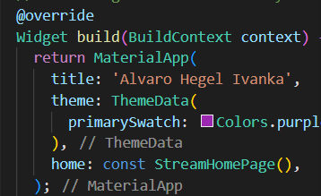
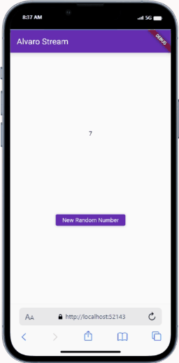
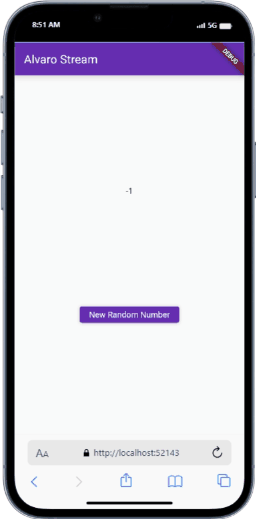
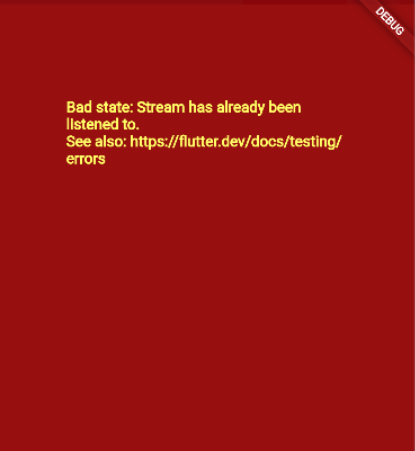
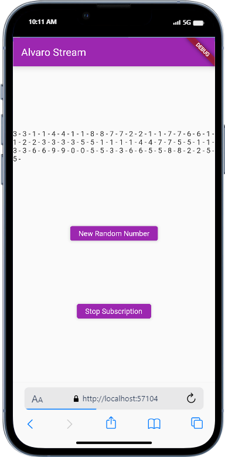
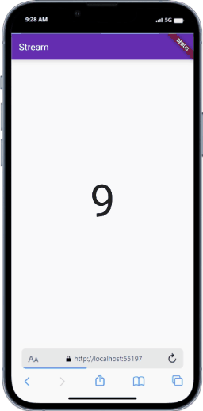
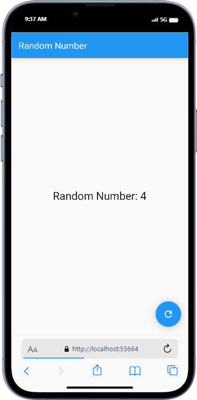

# Pertemuan Minggu 13 - Lanjutan State dengan Streams
Nama:Alvaro Hegel Ivanka
Kelas:3F
Nim2141720237

## Praktikum 1 - Dart Streams

### soal 1

- menambahkan nama pada tittle app dan merubah warna sesuai kesukaan

 

### soal 2

- menambahkan warna sesuai keinginan

 

### soal 3
- Jelaskan fungsi keyword yield* pada kode tersebut!
fungsi yields* adalah untuk mengirimkan nilai-nilai dari stream yang dihasilkan oleh ekspresi di sebelah kanan. Dengan kata lain, setiap fungsi ini dipanggil, akan mengirimkan warna dari stream yang dihasilkan oleh Stream.periodi

- Apa maksud isi perintah kode tersebut?
kode tersebut membuat sebuah stream yang menghasilkan warna dari daftar warna setiap detik. yield* digunakan untuk mengirimkan nilai-nilai dari stream yang dihasilkan oleh Stream.periodic. Tujuan akhirnya adalah menghasilkan suatu stream yang terus-menerus mengeluarkan warna-warna yang ada dalam daftar colors.

### soal 4

- capture hasil

### soal 5

- Jelaskan perbedaan menggunakan listen dan await for (langkah 9) !
*await forcdigunakan dalam fungsi yang diawasi oleh async. Hal ini memungkinkan pengguna untuk melakukan iterasi secara langsung melalui setiap elemen baru sebelum melanjutkan ke elemen berikutnya. Cocok digunakan dalam blok fungsi yang sifatnya async dan digunakan dalam fungsi yang dijelaskan dengan async
listen digunakan untuk diluar konteks fungsi yang dijelaskan dengan async. Metode listen adalah metode pada objek stream yang memungkinkan untuk mendaftarkan fungsi callback yang akan dipanggil setiap kali ada data yang tersedia di dalam stream.
Jadi, jika ingin melakukan iterasi secara langsung dan menggunakan await di dalam fungsi yang diawasi, gunakan *await for. Jika Anda hanya perlu mendengarkan perubahan stream dan menjalankan fungsi callback ketika ada data baru, Anda dapat menggunakan *listen.

## Praktikum 2

### soal 6

-Jelaskan maksud kode langkah 8 dan 10 tersebut!
Langkah 8 adalah ketika menginisialisasi objek NumberStream, mengambil controller stream, dan mendengarkan perubahan pada stream angka. Setiap kali ada perubahan, nilai terakhir (lastNumber) dalam state diperbarui menggunakan setState().
Langkah 10 adalah fungsi addRandomNumber membuat objek Random untuk menghasilkan angka acak antara 0 dan 9. Nilai acak tersebut kemudian ditambahkan ke dalam stream menggunakan metode addNumberToSink pada objek numberStream.

capture hasil praktikum

### soal 7
- Jelaskan maksud kode langkah 13 sampai 15 tersebut!
Kode langkah 13-15 akan membuat handling ketika terjadi sebuah error menggunakan methode addError() pada class stream.dart. Jika terjadi error atau kesalahan selama proses iterasi, maka nilai dari lastNumber diatur menjadi -1

## praktikum 3

### soal 8

- Jelaskan maksud kode langkah 1-3 tersebut!
Kode langkah 1-3 mendeklarasikan dan menginisialisasi objek StreamTransformer <int, int> dengan nama transformer. Transformer ini mengubah setiap data dalam stream angka dengan mengalikannya dengan 10, menangani kesalahan dengan mengirimkan nilai -1, dan menutup sink saat stream selesai. Selanjutnya, kode menggunakan transformer tersebut untuk mengubah data dalam stream dari objek numberStreamController, dan hasilnya diobservasi. Setiap kali ada perubahan, nilai terakhir (lastNumber) dalam state diperbarui, dan jika terjadi kesalahan, nilai -1 akan di-set ke dalam state.

capture hasilnya

## praktikum 4

### soal 9

- Jelaskan maksud kode langkah 2, 6 dan 8 tersebut!
Kode langkah 2 untuk melakukan langganan pada stream agar mendapatkan informasi ataupun output dari stream
Kode langkah 6 untuk pembatalan subscribe pada stream. Jadi ketika screen tidak ditampilkan, metode ini akan dipanggil. Hal ini berguna untuk membersihkan sumber daya dan menghemat penyimpanan
Kode langkah 8 adalah fungsi addRandomNumber membuat objek Random untuk menghasilkan angka acak antara 0 dan 9. Selanjutnya, fungsi tersebut memeriksa apakah numberStreamController sudah ditutup (closed). Jika belum ditutup, nilai acak tersebut ditambahkan ke dalam stream menggunakan metode addNumberToSink pada objek numberStream. Jika numberStreamController sudah ditutup, maka nilai -1 akan di-set ke dalam state lastNumber. Ini bertujuan untuk menghindari penambahan data ke dalam stream yang sudah ditutup.

## praktikum 5

### soal 10

- jelaskan mengapa error itu terjadi?

- Error diatas terjadi karena kita saya mencoba menambahkan dua subscription pada stream yang sama tanpa membatalkan subscription sebelumnya.

### soal 11

- Jelaskan mengapa hal itu bisa terjadi ?
Hal ini terjadi dikarenakan ketika button new random number, maka akan menghasilkan dua angka yang sama karena pemanggilan oleh objek subscription dan subscription2, dan akan mengembalikan value berupa event angka random yang dipisahkan dengan tanda '-'. Ketika button stop stream ditekan, maka akan menghentia=kan langganan stream dan tidak bisa mengeluarkan output meskipun kita menekan button new random number.

## praktikum 6

### soal 12

- Jelaskan maksud kode pada langkah 3 dan 7 !
Kode langkah 3 adalah kode yang mendefinisikan kelas NumberStream yang memiliki metode getNumber. Metode ini mengembalikan Stream yang menghasilkan nilai acak antara 0 dan 9 setiap detiknya menggunakan Stream.periodic dan Random. Maka, kelas ini menyediakan aliran (stream) bilangan bulat acak dengan interval waktu satu detik.
Kode langkah 7 adalah widget StreamBuilder digunakan untuk membangun antarmuka pengguna yang merespons perubahan pada Stream. Dalam contoh ini, StreamBuilder menggunakan numberStream sebagai sumber data, memperbarui antarmuka secara otomatis ketika data baru tiba. Kondisi hasError menangani kesalahan, dan jika ada data, teks besar ditampilkan di tengah layar. Jika tidak ada data, widget dikembalikan sebagai kosong.

capture hasilnya

## praktikum 7

### soal 13

- Jelaskan maksud praktikum ini ! Dimanakah letak konsep pola BLoC-nya ?
Praktikum ini menciptakan aplikasi Flutter sederhana yang menggunakan pola BLoC (Business Logic Component) untuk mengelola logika bisnis dan pembaruan UI. Konsep pola BLoC terletak pada pembuatan kelas RandomNumberBloc yang bertanggung jawab untuk menghasilkan angka acak dan mengelola aliran data. Pola ini membantu memisahkan logika bisnis dari antarmuka pengguna.
Pola BLoC diterapkan pada cara berikut:
RandomNumberBloc memiliki dua StreamController: satu untuk input (_generateRandomController) dan satu untuk output (_randomNumberController).
Melalui metode generateRandom, komponen luar dapat memicu pembangkitan angka acak.
Pada saat inisialisasi RandomNumberBloc, sebuah listener ditambahkan ke _generateRandomController.stream yang memunculkan angka acak ke _randomNumberController.
RandomScreen kemudian menggunakan StreamBuilder untuk mendengarkan perubahan pada _bloc.randomNumber dan mengupdate UI dengan angka acak yang dihasilkan.

capture hasilnya

