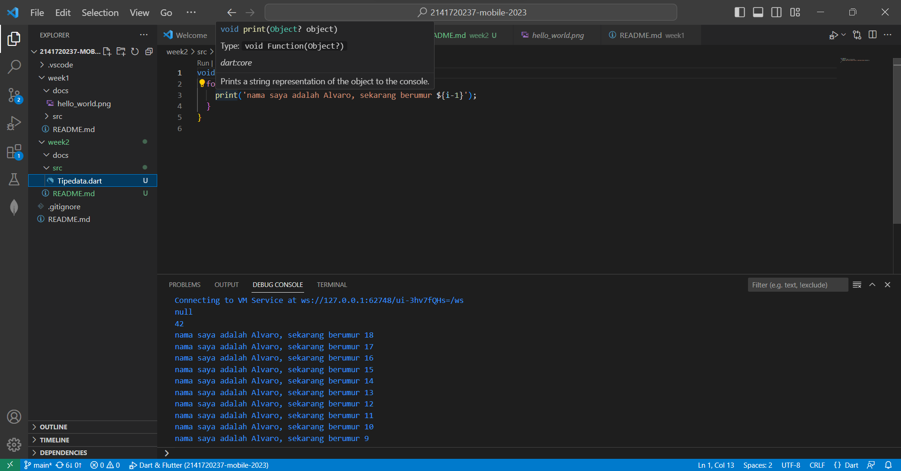

# pemrograman week 2
project hello world
nama:Alvaro Hegel Ivanka

nim:2141720237

soal 1

soal 2

Mengapa sangat penting untuk memahami bahasa pemrograman Dart sebelum kita menggunakan framework Flutter ? Jelaskan

jawab:
bahasa pemrograman Dart sangat penting karena Dart adalah bahasa pemrograman resmi yang digunakan untuk mengembangkan aplikasi dengan Flutter. Flutter adalah sebuah framework open-source yang dikembangkan oleh Google untuk membangun aplikasi lintas platform, termasuk iOS, Android, web, dan desktop, dengan menggunakan satu basis kode.Jadi, pemahaman bahasa pemrograman Dart merupakan fondasi yang penting sebelum menggunakan Flutter. Dengan memahami Dart dengan baik, Anda akan dapat mengembangkan aplikasi Flutter dengan lebih efisien, memperbaiki bug, dan memanfaatkan sepenuhnya kemampuan Flutter sebagai framework pengembangan aplikasi lintas platform.

soal 3

Rangkumlah materi dari codelab ini menjadi poin-poin penting yang dapat Anda gunakan untuk membantu proses pengembangan aplikasi mobile menggunakan framework Flutter.

jawab:
-mengetahui fitur mendalam dengan bahasa Dart; Kode aplikasi, kode plugin, dan manajemen dependensi semuanya menggunakan bahasa Dart beserta fitur-fiturnya. Memiliki pemahaman dasar yang kuat tentang Dart akan memudahkan Anda untuk menjadi lebih produktif dengan Flutter dan akan membuat Anda merasa nyaman dalam pengembangan Flutter.
- mengetahui evolusi atau perkembangan dart dari tahun ke tahun
- Mengidentifikasi bagaimana cara kerja bahasa pemrograman dart 
- Memahami struktur dari bahasa pemrograman dart seperti:operator dart,artimatic operator,increment and decrement operators,Equality and relational operators,dan logical operators
- Mengetahui dasar dasar sintaks dan kakas yang tersedia untuk pengembangan dart
- Mencoba coding dengan bahasa dart