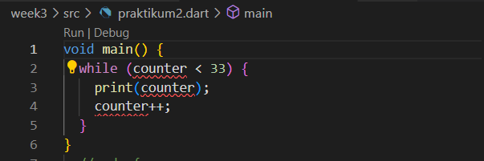
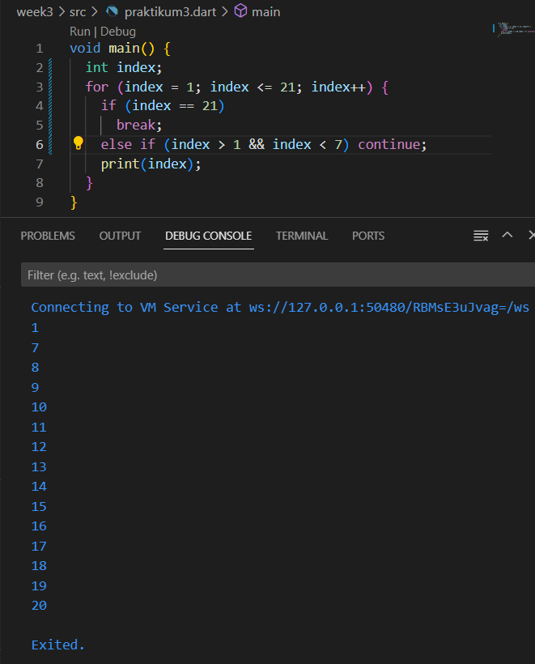

# pemrograman week 2
project Pengantar Bahasa Pemrograman Dart
nama:Alvaro Hegel Ivanka
nim:2141720237

## Praktikum 1: Menerapkan Control Flows ("if/else")
Langkah 1

Ketik atau salin kode program berikut ke dalam fungsi main()

Langkah 2

Silakan coba eksekusi (Run) kode pada langkah 1 tersebut. Apa yang terjadi? Jelaskan!

-menampilkan output test2 dan test 2 again karena kode pertama menginisialisasi variabel string test dengan nilai "test".kemudian kode memeriksa apakah test sama dengan test2.jika sama maka kode mencetak test2 again 

Langkah 3

Tambahkan kode program berikut, lalu coba eksekusi (Run) kode Anda.

Apa yang terjadi ? Jika terjadi error, silakan perbaiki namun tetap menggunakan if/else.

-kode tersebut mengalami error karena pada kode tersebut if merupakan string true sebagai kondisi.maka kode tersebut pernyataan if harus diubah menjadi nilai boolean

## Praktikum 2: Menerapkan Perulangan "WHILE" dan "DO-WHILE"

Langkah 1

Ketik atau salin kode program berikut ke dalam fungsi main().

Langkah 2

Silakan coba eksekusi (Run) kode pada langkah 1 tersebut. Apa yang terjadi? Jelaskan! Lalu perbaiki jika terjadi error.

-karena pada kode tersebut variabel counter belum diberi nilai.maka perbaikannya seperti kode dibawah ini

Langkah 3

Tambahkan kode program berikut, lalu coba eksekusi (Run) kode Anda.

Apa yang terjadi ? Jika terjadi error, silakan perbaiki namun tetap menggunakan do-while.

-saat kode tersebut dijalankan maka akan menghasilkan kode berikut

## Praktikum 3: Menerapkan Perulangan "FOR" dan "BREAK-CONTINUE"

Langkah 1

Ketik atau salin kode program berikut ke dalam fungsi main(). 

Langkah 2

Silakan coba eksekusi (Run) kode pada langkah 1 tersebut. Apa yang terjadi? Jelaskan! Lalu perbaiki jika terjadi error.

-hasil output diatas kode diatas adalah error karena kurang mendeklarasikan tipe data variabel index, maka dari itu perlu deklarasi variabel index dengan tipe datanya terlebih dahulu sebelum menggunakannya di dalam loop.perbaikan bisa dilakukan dengan cara dibawah ini

Langkah 3

Tambahkan kode program berikut di dalam for-loop, lalu coba eksekusi (Run) kode Anda.

-hasilnya menjadi error karena if,else if dan else harus ditulis menggunakan huruf kecil.perbaikkan kode yang error bisa seperti kode dibawah ini 

## TUGAS
Buatlah sebuah program yang dapat menampilkan bilangan prima dari angka 0 sampai 201 menggunakan Dart. Ketika bilangan prima ditemukan, maka tampilkan nama lengkap dan NIM Anda.

-kode

output
