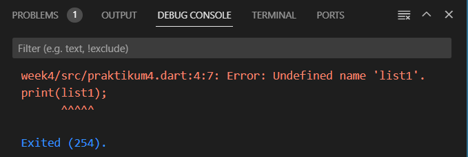

# pemrograman week 2
project Pengantar Bahasa Pemrograman Dart
nama:Alvaro Hegel Ivanka
nim:2141720237

## Praktikum 1: Eksperimen Tipe Data List
Langkah 1

Ketik atau salin kode program berikut ke dalam void main().

Langkah 2

Silakan coba eksekusi (Run) kode pada langkah 1 tersebut. Apa yang terjadi? Jelaskan!

-akan mencetak 3 dari panjang lenght,mencetak 2 dari list[1] didefinisikan dengan 2, dan mencetak 1 karena list[1] didefinisikan dengan 1

Langkah 3

Ubah kode pada langkah 1 menjadi variabel final yang mempunyai index = 5 dengan default value = null. Isilah nama dan NIM Anda pada elemen index ke-1 dan ke-2. Lalu print dan capture hasilnya.

Apa yang terjadi ? Jika terjadi error, silakan perbaiki

## Praktikum 2 : Eksperimen Tipe Data Set
Langkah 1

Ketik atau salin kode program berikut ke dalam fungsi main().

Langkah 2

Silakan coba eksekusi (Run) kode pada langkah 1 tersebut. Apa yang terjadi? Jelaskan! Lalu perbaiki jika terjadi error

-menampilkan value string yang terdapat pada halogens

Langkah 3

Tambahkan kode program berikut, lalu coba eksekusi (Run) kode Anda.

Apa yang terjadi ?

-menampilkan 2 set yang kosong yaitu names1, names2 dan 1 map yang kosong juga yaitu names3 

Jika terjadi error, silakan perbaiki namun tetap menggunakan ketiga variabel tersebut. Tambahkan elemen nama dan NIM Anda pada kedua variabel Set tersebut dengan dua fungsi berbeda yaitu .add() dan .addAll(). Untuk variabel Map dihapus, nanti kita coba di praktikum selanjutnya.

-add digunakan untuk mengisi 1 elemen kedalam set
sedangkan addall digunakan untuk mengisi beberapa elemen ke dalam set

## Praktikum 3 : Eksperimen Tipe Data Maps
Langkah 1

Ketik atau salin kode program berikut ke dalam fungsi main()

langkah 2

Silakan coba eksekusi (Run) kode pada langkah 1 tersebut. Apa yang terjadi? Jelaskan! Lalu perbaiki jika terjadi error

-Hasil eksekusi adalah menampilkan nilai dalam map gifts dan nobleGases.

langkah 3

Tambahkan kode program berikut, lalu coba eksekusi (Run) kode Anda

Apa yang terjadi ? 

-key pada kode tersebut bernama sama sehingga output yang ditampilkan adalah key terakhir sebelum print

Tambahkan elemen nama dan NIM Anda pada tiap variabel di atas (gifts, nobleGases, mhs1, dan mhs2). Dokumentasikan hasilnya dan buat laporannya!

## Praktikum 4 : Eksperimen Tipe Data List: Spread dan Control-flow Operators
Langkah 1
Ketik atau salin kode program berikut ke dalam fungsi main().

Langkah 2

Silakan coba eksekusi (Run) kode pada langkah 1 tersebut. Apa yang terjadi? Jelaskan! Lalu perbaiki jika terjadi error.

-terjadi error karna tidak ada deklarasi variabel (list1).maka perbaikkan kode tersebut adalah merubahnya menjadi (list)

Langkah 3

Tambahkan kode program berikut, lalu coba eksekusi (Run) kode Anda. Apa yang terjadi ? Jika terjadi error, silakan perbaiki. Tambahkan variabel list berisi NIM Anda menggunakan Spread Operators. Dokumentasikan hasilnya dan buat laporannya!

-terjadi error karena terjadinya kesalahaan pada list1 dimana tidak dideklarasikan sebelumnya

perbaikkan dan tambahan variabel list berisi NIM Anda menggunakan Spread Operators. Dokumentasikan hasilnya dan buat laporannya!

Langkah 4

Tambahkan kode program berikut, lalu coba eksekusi (Run) kode Anda.

Apa yang terjadi ? Jika terjadi error, silakan perbaiki.

-terjadi error yang disebabkan var promoActive tidak dikenali karena belum dideklarasikan.

Tunjukkan hasilnya jika variabel promoActive ketika true dan false.

-Namun ketika nilai dari var promoActive diubah menjadi false, maka elemen 'Outlet' tidak ditampilkan.

Langkah 5

Tambahkan kode program berikut, lalu coba eksekusi (Run) kode Anda.

-terdapat error yang menunjukkan bahwa var login tidak dikenali karena belum dideklarasikan.

Tunjukkan hasilnya jika variabel login mempunyai kondisi lain.

Langkah 6

Tambahkan kode program berikut, lalu coba eksekusi (Run) kode Anda.

Apa yang terjadi ? Jika terjadi error, silakan perbaiki. Jelaskan manfaat Collection For dan dokumentasikan hasilnya.

-tidak terjadi error, dikarenakan pendefinisian ataupun stuktur sudah benar. Namun di sini var listOfStrings,dimana var tersebut berisi nilai '#0', yang didefinisikan for untuk mengecek kondisi tertentu.dan dilakukan pemanggilan nilai-nilai dalam var listOfInts, yang kemudian disimpan dalam var i, dan ditampilakan dengan menambahkan karakter '#' sebelum nilai yang dipanggil.

## Praktikum 5 - Eksperimen Tipe Data Records

Langkah 1

Ketik atau salin kode program berikut ke dalam fungsi main().

Langkah 2

Silakan coba eksekusi (Run) kode pada langkah 1 tersebut. Apa yang terjadi? Jelaskan! Lalu perbaiki jika terjadi error.

-terdapat error dikarenakan tidak ada (;) sebagai pemisah anatara pernyataan di dalam kode

Langkah 3

Tambahkan kode program berikut di luar scope void main(), lalu coba eksekusi (Run) kode Anda.

Apa yang terjadi ? 

-tidak terjadi error namun kode yang terdapat diluar scope main() tidak dijalankan

Jika terjadi error, silakan perbaiki. Gunakan fungsi tukar() di dalam main() sehingga tampak jelas proses pertukaran value field di dalam Records.

Langkah 4

Tambahkan kode program berikut di dalam scope void main(), lalu coba eksekusi (Run) kode Anda.

Apa yang terjadi ? Jika terjadi error, silakan perbaiki. Inisialisasi field nama dan NIM Anda pada variabel record mahasiswa di atas. Dokumentasikan hasilnya dan buat laporannya!

-terdapat error karena pemanggilan var mahasiswa yang belum diberikan nilai apapun

Langkah 5

Tambahkan kode program berikut di dalam scope void main(), lalu coba eksekusi (Run) kode Anda.

Apa yang terjadi ? Jika terjadi error, silakan perbaiki. Gantilah salah satu isi record dengan nama dan NIM Anda, lalu dokumentasikan hasilnya dan buat laporannya!

-tidak menghasilkan error setelah dieksekusi. Pada kode tersebut terdapat pemanggilan atau pengaksessan field dengan sintaks $, dengan mengabaikan field yang mempunyai key atau nama, seperti field 'first', dipanggil dengan $1, bukan $first.

## Tugas Praktikum
1.Silakan selesaikan Praktikum 1 sampai 5, lalu dokumentasikan berupa screenshot hasil pekerjaan Anda beserta penjelasannya!

-diatas

2.Jelaskan yang dimaksud Functions dalam bahasa Dart!

-Function adalah sekumpulan blok kode yang dapat menerima input, melakukan komputasi atau proses, serta mengembalikan nilai (return).

3.Jelaskan jenis-jenis parameter di Functions beserta contoh sintaksnya!

-Positional Parameters (Parameter Posisi):
   - Parameter-posisi adalah jenis parameter yang didefinisikan berdasarkan posisi mereka dalam daftar parameter fungsi.
   - Untuk menggunakan parameter-posisi, Anda harus menyebutkan nilai-nilai argumen dalam urutan yang sama dengan definisi parameter-posisi dalam deklarasi fungsi.
   - Contoh:

   

Named Parameters (Parameter Nama):
   - Parameter-nama adalah jenis parameter yang diberi nama dan bersifat opsional.
   - Anda dapat menggunakan parameter-nama dengan menyebutkan nama parameter saat menyediakan argumen, sehingga argumen dapat diberikan dalam urutan yang berbeda atau bahkan diabaikan.
   - Contoh:

   

Default Parameters (Parameter Default):
   - Parameter-default adalah jenis parameter yang memiliki nilai default yang akan digunakan jika argumen tidak disediakan saat pemanggilan fungsi.
   - Anda dapat memberikan nilai default kepada parameter-posisi maupun parameter-nama.
   - Contoh:

   

Required Parameters (Parameter Wajib):
   - Parameter-wajib adalah jenis parameter yang harus diberikan argumen saat pemanggilan fungsi.
   - Jika argumen tidak disediakan untuk parameter-wajib, akan terjadi kesalahan saat kompilasi.
   - Contoh:

    

4.Jelaskan maksud Functions sebagai first-class objects beserta contoh sintaknya!

-berarti bahwa fungsi dianggap sebagai objek yang dapat diperlakukan seperti objek lainnya. Dalam konteks ini, fungsi dapat disimpan dalam variabel, diteruskan sebagai argumen ke fungsi lain, dan juga dapat dikembalikan sebagai nilai dari fungsi lain. Hal ini memungkinkan penggunaan fungsi dengan fleksibilitas yang tinggi dalam pemrograman.contoh:

5.Apa itu Anonymous Functions? Jelaskan dan berikan contohnya!

-adalah fungsi yang tidak memiliki nama yang terikat secara langsung ke dalam kode. Mereka sering digunakan ketika Anda hanya perlu mendefinisikan dan menggunakan fungsi sederhana tanpa harus memberikan nama formal ke fungsi tersebut.contoh:

6.Jelaskan perbedaan Lexical scope dan Lexical closures! Berikan contohnya!

-Lexical Scope (Lingkup Leksikal):
   - Lexical scope mengacu pada aturan penentuan visibilitas atau jangkauan variabel dalam kode berdasarkan struktur penulisan kode tersebut.
   - Dalam lexical scope, visibilitas variabel ditentukan oleh tempat atau posisi di mana variabel itu dideklarasikan dalam kode.
   - Variabel yang dideklarasikan di dalam sebuah blok atau fungsi hanya dapat diakses di dalam blok atau fungsi tersebut, serta di dalam blok-blok atau fungsi-fungsi yang tersemat di dalamnya.
    contoh:

    

Lexical Closures (Penutupan Leksikal):
   - Lexical closures mengacu pada kemampuan fungsi untuk "mengingat" lingkungan leksikal (lexical environment) di mana ia dideklarasikan, bahkan ketika fungsi tersebut dieksekusi di luar lingkungan leksikal aslinya.
   - Dalam lexical closures, fungsi dapat mengakses dan mereferensikan variabel-variabel yang berada di luar fungsi itu sendiri, tetapi masih dalam ruang lingkup leksikal di mana fungsi tersebut dideklarasikan.
   - Fungsi yang memiliki kemampuan ini disebut sebagai "closure" karena mereka "menutup" atau mempertahankan lingkungan leksikal di sekitar mereka.
   contoh:

   

7.Jelaskan dengan contoh cara membuat return multiple value di Functions!

-Terdapat beberapa cara untuk melakukan return multiple value, salah satunya dengan maps.
contoh:

