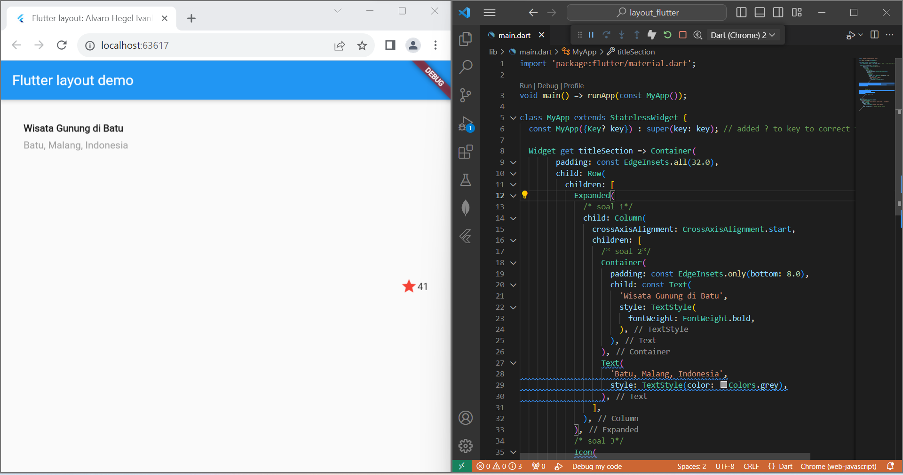
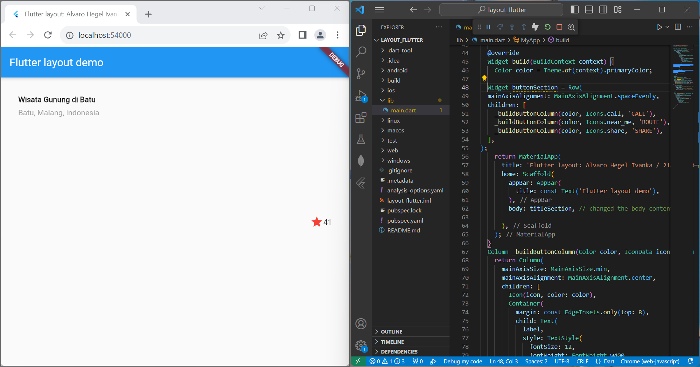
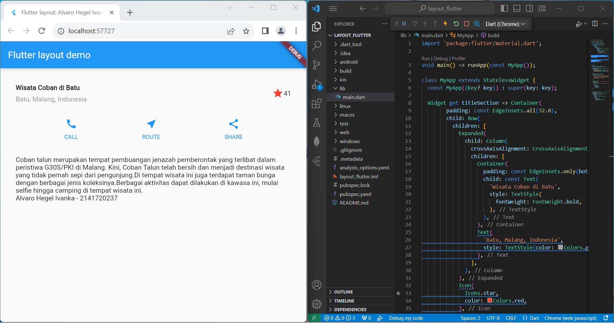
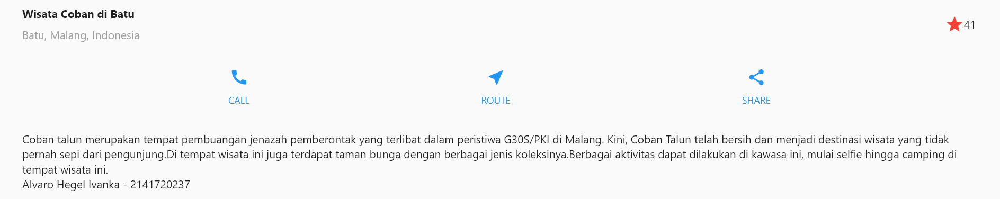

# pemrograman week 5
project Flutter Fundamental
nama:Alvaro Hegel Ivanka
nim:2141720237

## Praktikum 1: Membangun Layout di Flutter

## Praktikum 2: Implementasi button row

## Praktikum 3: Implementasi text section

## Praktikum 4 : Implementasi Image Section

